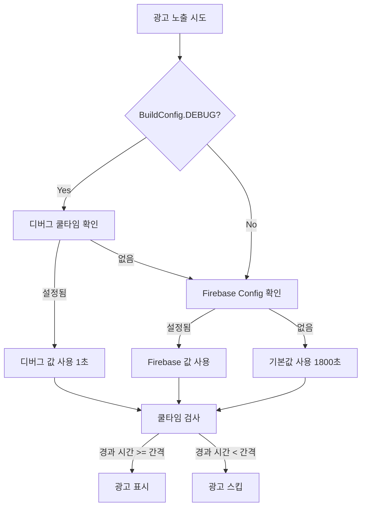

# AdPolicyManager - 광고 정책 관리 가이드

> **작성일**: 2025-12-02  
> **버전**: 1.0.0  
> **대상**: 안드로이드 개발자

## 📋 목차

1. [개요](#개요)
2. [핵심 기능](#핵심-기능)
3. [아키텍처 설계](#아키텍처-설계)
4. [사용 방법](#사용-방법)
5. [쿨타임 우선순위](#쿨타임-우선순위)
6. [디버그 모드 활용](#디버그-모드-활용)
7. [테스트 시나리오](#테스트-시나리오)
8. [트러블슈팅](#트러블슈팅)

---

## 개요

### 목적

`AdPolicyManager`는 **전면 광고(Interstitial Ad)의 노출 정책을 통합 관리**하는 싱글톤 객체입니다.

### 주요 특징

- ✅ **쿨타임 제어**: 광고 노출 간격을 동적으로 관리
- ✅ **디버그 오버라이드**: 개발 중 빠른 테스트를 위한 쿨타임 설정
- ✅ **릴리즈 안정성**: 하나의 로직으로 릴리즈/디버그 모두 지원
- ✅ **Firebase 준비**: Remote Config 통합 준비 완료
- ✅ **영구 저장**: SharedPreferences로 상태 유지

### 파일 위치

```
app/src/main/java/kr/sweetapps/alcoholictimer/data/repository/AdPolicyManager.kt
```

---

## 핵심 기능

### 1. 쿨타임 간격 조회

```kotlin
fun getInterstitialIntervalSeconds(context: Context): Long
```

**역할**: 현재 적용할 쿨타임 간격(초)을 반환합니다.

**반환값**:
- 디버그 모드: 설정된 오버라이드 값 (기본 1초)
- 릴리즈 모드: 30분 (1800초)

**우선순위**:
1. 디버그 모드 오버라이드 (DEBUG 빌드만)
2. Firebase Remote Config (추후 구현)
3. 하드코딩 기본값 (1800초)

### 2. 광고 노출 가능 여부 확인

```kotlin
fun shouldShowInterstitialAd(context: Context): Boolean
```

**역할**: 현재 전면 광고를 노출해도 되는지 결정합니다.

**동작**:
1. 쿨타임 간격 조회
2. 마지막 노출 시간 확인
3. 경과 시간 비교
4. 노출 가능하면 마지막 노출 시간 업데이트

**반환값**:
- `true`: 광고 노출 가능 (쿨타임 경과)
- `false`: 쿨타임 중 (광고 스킵)

### 3. 디버그 쿨타임 설정

```kotlin
fun setDebugCoolDownSeconds(context: Context, seconds: Long)
```

**역할**: 디버그 모드에서 쿨타임을 수동으로 설정합니다.

**파라미터**:
- `seconds`: 쿨타임 간격(초)
- 권장값: `1` (빠른 테스트용)

**제약**:
- `BuildConfig.DEBUG == true`일 때만 작동
- 릴리즈 빌드에서는 무시됨

### 4. 디버그 쿨타임 조회

```kotlin
fun getDebugCoolDownSeconds(context: Context): Long
```

**역할**: 현재 설정된 디버그 쿨타임을 반환합니다.

**반환값**:
- 설정된 값 (초)
- 설정 안 됨: `-1`

### 5. 노출 시간 초기화 (테스트용)

```kotlin
fun resetLastShownTime(context: Context)
```

**역할**: 마지막 광고 노출 시간을 초기화합니다.

**사용 시기**:
- 테스트 중 즉시 광고를 다시 보고 싶을 때
- 디버그 메뉴에서 호출 가능

---

## 아키텍처 설계

### 설계 원칙

#### 1. 하나의 로직, 다양한 설정

```
릴리즈 빌드              디버그 빌드
     ↓                      ↓
getInterstitialIntervalSeconds()
     ↓                      ↓
  1800초 (30분)          1초 (설정 가능)
     ↓                      ↓
shouldShowInterstitialAd()
     ↓                      ↓
    동일한 쿨타임 검사 로직
```

#### 2. 쿨타임 우선순위 계층

```
┌─────────────────────────────────────┐
│ 1순위: 디버그 오버라이드            │
│    (SharedPreferences)              │
│    - DEBUG 빌드만 적용               │
│    - 1초 권장 (빠른 테스트)          │
└─────────────────────────────────────┘
              ↓ (없으면)
┌─────────────────────────────────────┐
│ 2순위: Firebase Remote Config       │
│    (추후 구현)                       │
│    - 서버에서 동적 제어               │
│    - A/B 테스트 가능                 │
└─────────────────────────────────────┘
              ↓ (없으면)
┌─────────────────────────────────────┐
│ 3순위: 하드코딩 기본값               │
│    (DEFAULT_INTERSTITIAL_INTERVAL)  │
│    - 1800초 (30분)                   │
│    - 폴백(Fallback) 용도             │
└─────────────────────────────────────┘
```

### 데이터 저장 구조

#### SharedPreferences 키

| 키 이름 | 타입 | 용도 | 빌드 제약 |
|:---|:---:|:---|:---:|
| `ad_policy_prefs` | Prefs 파일명 | 광고 정책 전용 저장소 | - |
| `last_interstitial_time_ms` | Long | 마지막 광고 노출 시간 (밀리초) | - |
| `debug_ad_cool_down_seconds` | Long | 디버그 쿨타임 (초) | DEBUG 전용 |

---

## 사용 방법

### 기본 사용 패턴

#### StartScreen에서 광고 표시

```kotlin
// StartScreen.kt - 시작 버튼 클릭 시
MainActionButton(
    onClick = {
        // [1] 광고 정책 확인
        val shouldShowAd = AdPolicyManager.shouldShowInterstitialAd(context)
        
        if (shouldShowAd) {
            // [2-1] 쿨타임 OK → 광고 표시
            if (activity != null && InterstitialAdManager.isLoaded()) {
                InterstitialAdManager.show(activity) { success ->
                    // 광고 종료 후 카운트다운
                    showCountdown = true
                }
            } else {
                // 광고 없음 → 즉시 카운트다운
                showCountdown = true
            }
        } else {
            // [2-2] 쿨타임 중 → 광고 스킵
            Log.d("StartScreen", "전면 광고 쿨타임 중 -> 광고 스킵")
            showCountdown = true
        }
    }
)
```

#### FinishedScreen에서 광고 표시

```kotlin
// FinishedScreen.kt - 결과 확인 버튼 클릭 시
Button(
    onClick = {
        // [1] 광고 정책 확인
        val shouldShowAd = AdPolicyManager.shouldShowInterstitialAd(context)
        
        if (shouldShowAd && activity != null && InterstitialAdManager.isLoaded()) {
            // [2-1] 쿨타임 OK → 광고 표시
            InterstitialAdManager.show(activity) { success ->
                onResultCheck() // 결과 화면으로 이동
            }
        } else {
            // [2-2] 쿨타임 중 또는 광고 없음 → 즉시 이동
            onResultCheck()
        }
    }
)
```

---

## 쿨타임 우선순위

### 동작 플로우



### 예시 시나리오

#### 시나리오 1: 릴리즈 빌드

```
사용자가 시작 버튼 클릭 (첫 번째)
  ↓
AdPolicyManager.shouldShowInterstitialAd()
  ↓
getInterstitialIntervalSeconds() = 1800초 (30분)
  ↓
마지막 노출 시간 = 0 (처음)
  ↓
경과 시간 = 무한대 > 1800초
  ↓
광고 표시 ✅
마지막 노출 시간 업데이트

--- 10분 후 ---

사용자가 다시 시작 버튼 클릭
  ↓
경과 시간 = 600초 < 1800초
  ↓
광고 스킵 ⏭️

--- 20분 더 경과 (총 30분) ---

사용자가 다시 시작 버튼 클릭
  ↓
경과 시간 = 1800초 >= 1800초
  ↓
광고 표시 ✅
```

#### 시나리오 2: 디버그 빌드 (쿨타임 1초)

```
개발자가 디버그 메뉴에서 쿨타임 1초 설정
  ↓
사용자가 시작 버튼 클릭
  ↓
getInterstitialIntervalSeconds() = 1초
  ↓
경과 시간 > 1초
  ↓
광고 표시 ✅

--- 1초 후 ---

다시 시작 버튼 클릭
  ↓
경과 시간 = 1초 >= 1초
  ↓
광고 표시 ✅ (빠른 테스트 가능!)
```

---

## 디버그 모드 활용

### 디버그 UI 위치

```
Tab 5 (더보기) → 디버그 메뉴 → "전면 광고 쿨타임 (초)"
```

### UI 컴포넌트

```kotlin
// DebugScreen.kt
if (BuildConfig.DEBUG) {
    Column {
        Text("전면 광고 쿨타임 (초)")
        
        OutlinedTextField(
            value = coolDownInput.value,
            onValueChange = { newValue ->
                if (newValue.all { it.isDigit() }) {
                    coolDownInput.value = newValue
                    val seconds = newValue.toLongOrNull() ?: 1L
                    viewModel.setDebugAdCoolDown(context, seconds)
                }
            },
            keyboardOptions = KeyboardOptions(
                keyboardType = KeyboardType.Number
            ),
            placeholder = { Text("1 (테스트용)") }
        )
    }
}
```

### 권장 설정값

| 테스트 목적 | 권장 쿨타임 | 설명 |
|:---|:---:|:---|
| **빠른 반복 테스트** | `1초` | 거의 제한 없이 광고 테스트 |
| **실제 간격 테스트** | `10초` | 쿨타임 동작 확인용 |
| **릴리즈 시뮬레이션** | `1800초` | 실제 릴리즈 환경 재현 |
| **즉시 테스트** | `0초` + `resetLastShownTime()` | 쿨타임 무시 |

---

## 테스트 시나리오

### 테스트 1: 기본 쿨타임 동작 확인

```bash
# 1. 디버그 빌드 설치
adb install -r app/build/outputs/apk/debug/app-debug.apk

# 2. 앱 실행
adb shell am start -n kr.sweetapps.alcoholictimer/.MainActivity

# 3. 로그 확인
adb logcat | findstr "AdPolicyManager"

# 예상 로그:
# AdPolicyManager: 기본 쿨타임 사용: 1800 초 (30분)
# AdPolicyManager: 전면 광고 노출 가능 여부 확인:
# AdPolicyManager:   - 쿨타임 간격: 1800 초
# AdPolicyManager:   - 노출 가능: true
```

### 테스트 2: 디버그 쿨타임 오버라이드

```bash
# 1. 디버그 메뉴 진입
# Tab 5 → 디버그 메뉴

# 2. "전면 광고 쿨타임 (초)" 필드에 "1" 입력

# 3. 로그 확인
adb logcat | findstr "AdPolicyManager DebugScreen"

# 예상 로그:
# DebugScreen: 전면 광고 쿨타임 설정: 1 초
# AdPolicyManager: 디버그 쿨타임 설정 완료: 1 초
# AdPolicyManager: 디버그 모드 쿨타임 오버라이드: 1 초

# 4. 시작 버튼 클릭 테스트
# - 1초마다 광고 표시 가능 확인
```

### 테스트 3: 릴리즈 빌드 검증

```bash
# 1. 릴리즈 빌드 생성
./gradlew assembleRelease

# 2. 설치
adb install -r app/build/outputs/apk/release/app-release.apk

# 3. 디버그 UI가 표시되지 않는지 확인
# Tab 5 → 디버그 메뉴
# → "전면 광고 쿨타임 (초)" 필드 없어야 함 ✅

# 4. 로그 확인
adb logcat | findstr "AdPolicyManager"

# 예상 로그:
# AdPolicyManager: 기본 쿨타임 사용: 1800 초 (30분)
# (디버그 오버라이드 로그 없어야 함)
```

---

## 트러블슈팅

### Q1. 디버그 모드인데 쿨타임 설정이 적용 안 됨

**증상**:
```
AdPolicyManager: 기본 쿨타임 사용: 1800 초 (30분)
```

**원인**:
- `BuildConfig.DEBUG == false`
- 릴리즈 빌드로 설치됨

**해결**:
```bash
# 빌드 타입 확인
./gradlew tasks --all | findstr "assemble"

# 디버그 빌드로 재설치
./gradlew installDebug
```

---

### Q2. 쿨타임 1초로 설정했는데 광고가 매번 뜸

**증상**:
```
AdPolicyManager: 노출 가능: true (항상)
```

**원인**:
- 정상 동작입니다!
- 1초 쿨타임은 거의 항상 경과하므로 의도된 동작

**확인**:
```bash
# 로그에서 경과 시간 확인
adb logcat | findstr "경과 시간"

# 예상 출력:
# AdPolicyManager:   - 경과 시간: 5 초
# → 1초 > 1초 이므로 노출 가능
```

---

### Q3. 광고가 전혀 표시되지 않음

**체크리스트**:

1. **광고 로드 상태 확인**
```kotlin
InterstitialAdManager.isLoaded() // false?
```

2. **쿨타임 확인**
```bash
adb logcat | findstr "노출 가능"
# AdPolicyManager:   - 노출 가능: false
```

3. **마지막 노출 시간 초기화**
```kotlin
// DebugScreen에 버튼 추가
Button(onClick = {
    AdPolicyManager.resetLastShownTime(context)
    Toast.makeText(context, "광고 시간 초기화", Toast.LENGTH_SHORT).show()
})
```

---

### Q4. 릴리즈에서 30분이 너무 길어요

**Firebase Remote Config 통합 (추후 구현)**:

```kotlin
// AdPolicyManager.kt
fun getInterstitialIntervalSeconds(context: Context): Long {
    // [1단계] 디버그 오버라이드
    if (BuildConfig.DEBUG) { ... }
    
    // [2단계] Firebase Remote Config ⬅️ 추가 예정
    try {
        val firebaseRemoteConfig = FirebaseRemoteConfig.getInstance()
        val remoteInterval = firebaseRemoteConfig.getLong("interstitial_interval_seconds")
        if (remoteInterval > 0) {
            Log.d(TAG, "Firebase 쿨타임: $remoteInterval 초")
            return remoteInterval
        }
    } catch (t: Throwable) {
        Log.e(TAG, "Firebase 로드 실패", t)
    }
    
    // [3단계] 기본값
    return DEFAULT_INTERSTITIAL_INTERVAL_SECONDS
}
```

---

## 요약

### 핵심 포인트

| 항목 | 설명 |
|:---|:---|
| **목적** | 전면 광고 노출 정책 통합 관리 |
| **핵심 기능** | 쿨타임 제어, 디버그 오버라이드 |
| **디버그 권장값** | 1초 (빠른 테스트) |
| **릴리즈 기본값** | 1800초 (30분) |
| **우선순위** | 디버그 → Firebase → 기본값 |
| **저장소** | SharedPreferences (`ad_policy_prefs`) |

### 개발자 체크리스트

- [ ] 디버그 빌드에서 쿨타임 1초로 설정
- [ ] 시작 버튼에서 `shouldShowInterstitialAd()` 호출 확인
- [ ] 결과 확인 버튼에서 `shouldShowInterstitialAd()` 호출 확인
- [ ] 릴리즈 빌드에서 디버그 UI 숨겨지는지 확인
- [ ] 릴리즈 빌드에서 30분 쿨타임 작동 확인
- [ ] 로그에서 "디버그 모드 쿨타임 오버라이드" 메시지 확인 (디버그)
- [ ] 로그에서 "기본 쿨타임 사용" 메시지 확인 (릴리즈)

---

**작성자**: GitHub Copilot  
**문서 버전**: 1.0.0  
**최종 수정**: 2025-12-02

